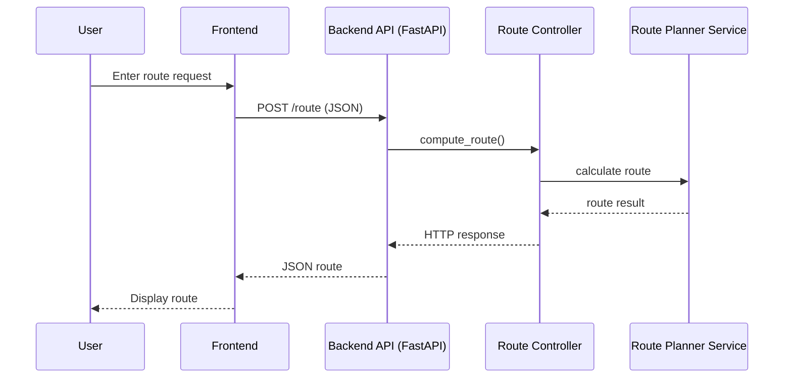

# Indoor Shopping Navigation

Indoor navigation prototype developed within the **Location Based Services** master course.

Indoor Shopping Navigation is a prototype for routing shoppers through an indoor store layout. The project consists of a **FastAPI backend** for route calculation and product data, and a **React frontend (Vite + TypeScript)** for visualizing the floor plan, route, and shopping list. A SQLite database was configured as well as a separate, independent algorithm evaluation pipeline to determine the best algorithm for the backend.

---

## Prerequisites

- Python 3.10 or newer  
- Node.js 18 or newer  
- npm (ships with Node.js)

The following commands are for **Windows PowerShell**. Adjust paths as needed.

---

## Contents

- [Project goals](#project-goals)
- [Architecture](#architecture)
- [Repository layout](#repository-layout)
- [Getting started](#getting-started)
  - [Backend (FastAPI)](#backend-fastapi)
  - [Frontend (React--Vite)](#frontend-react--vite)
- [Configuration](#configuration)
- [Development workflow (best practices)](#development-workflow-best-practices)
- [Testing](#testing)
- [Troubleshooting](#troubleshooting)
- [Contributing](#contributing)

---

## Project Goals

- Provide an API that returns products and optimized routes through the store graph  
- Render the store layout, shopping list, and computed route in a web UI  
- Keep the system modular and easy to extend with new layouts or routing logic  

---

## Architecture

- **Backend**
  - FastAPI application located in `app/server/`
  - Endpoints:
    - `GET /api/health`
    - `GET /products`
    - `POST /route`

- **Frontend**
  - React application using Vite and TypeScript in `app/frontend/`
  - Uses layout data from `app/frontend/public/layout.json`
  - Reads API base URL from environment variables

- **Database**
  - SQLite database file `indoor_shopping_nav.db` by default

- **Algorithm experiments**
  - Located in `algorithm_testing/`

---

## Repository Layout

## Architecture

- **Backend**: FastAPI application located in `app/server/`
  - `GET /api/health` – health checks
  - `GET /products` – product metadata
  - `POST /route` – optimized route calculation
- **Frontend**: React (Vite + TypeScript) located in `app/frontend/`
  - Uses layout data from `app/frontend/public/layout.json`
  - Reads API base URL from environment configuration
- **Database**: SQLite database file at the repository root (`indoor_shopping_nav.db`) by default
- **Algorithm experiments**: Prototypes and benchmarking in `algorithm_testing/`

---

## Repository Layout

```
app/
  frontend/          # React + Vite app
  server/            # FastAPI backend
  database/          # Database-related resources
resources/           # Supporting assets
algorithm_testing/   # Algorithm experiments + benchmarks
```

---

## Getting Started

### Backend (FastAPI)

1. Change into the backend folder:

```powershell
cd .\app\server
```

2. Create and activate a virtual environment (recommended):

```powershell
python -m venv .venv
.\.venv\Scripts\Activate.ps1
```

3. Install dependencies:

```powershell
pip install fastapi uvicorn networkx
```

4. Start the server:

```powershell
uvicorn app:app --reload --host 127.0.0.1 --port 8000
```

The API is available at:

- http://127.0.0.1:8000  
- Swagger documentation at http://127.0.0.1:8000/docs

---

### Frontend (React + Vite)

1. Change into the frontend folder:

```powershell
cd .\app\frontend
```

2. Install dependencies:

```powershell
npm install
```

3. Start the development server:

```powershell
npm run dev
```

4. Open the displayed URL in the browser (default):

- http://127.0.0.1:5173

---

## Configuration

Start backend and frontend in separate terminals.

| Setting | Purpose | Default |
|--------|--------|--------|
| `PORT` | API server port | `8000` |
| `DB_PATH` | SQLite file path | `<repo>/indoor_shopping_nav.db` |
| `VITE_API_BASE_URL` | Frontend API base URL | `http://127.0.0.1:8000` |

### Frontend Environment File

Create a file at:

```
app/frontend/.env
```

With the following content:

```
VITE_API_BASE_URL=http://127.0.0.1:8000
```

### Backend Environment File

Create a file at:

```
app/server/.env
```

With the following content:

```
PORT=8000
DB_PATH=/absolute/path/to/indoor_shopping_nav.db
```

---

## Layout Data

The store layout is defined in:

```
app/frontend/public/layout.json
```

This file contains polygon and node data for the floor plan. Adjust this file if the layout changes.

---

## Usage

- The red marker shows the current position
- The blue marker shows the next target
- When checking off a product, the position jumps to that product
- Completed and upcoming segments are displayed in light red
- The active segment is highlighted in red

---

## Development Workflow (Best Practices)

- **Keep config out of code**: Use environment variables or `.env` files
- **Isolate dependencies**: Use a Python virtual environment and local Node modules
- **Small, focused changes**: One logical change per commit
- **Document assumptions**: Update this README when APIs or data contracts change
- **Prefer typed data contracts**: Keep frontend and backend payloads in sync
- **Validate inputs**: Sanitize API requests and return clear error messages
- **Log sparingly but usefully**: Log startup configuration and route errors
- **Keep sample data separate**: Store fixtures outside production tables
- **Automate checks**: Add linting and tests when extending features

---

## Testing

No automated tests are configured yet.

If you add tests:

- **Backend**: Add `pytest` and a `tests/` folder under `app/server/`
- **Frontend**: Consider `vitest` or React Testing Library

---

## Troubleshooting

- `npm run dev` fails  
  - Run `npm install`
  - Check if port 5173 is already in use

- Backend not reachable  
  - Verify Uvicorn is running
  - Confirm the configured port matches `VITE_API_BASE_URL`

- Layout not displayed  
  - Validate `app/frontend/public/layout.json` is valid JSON

---

## UML Sequence Diagram (Mermaid)



---

## Contributing

1. Create a feature branch
2. Make your change with a clear, focused commit
3. Update documentation if APIs or configuration change
4. Open a pull request with a clear summary and testing notes
