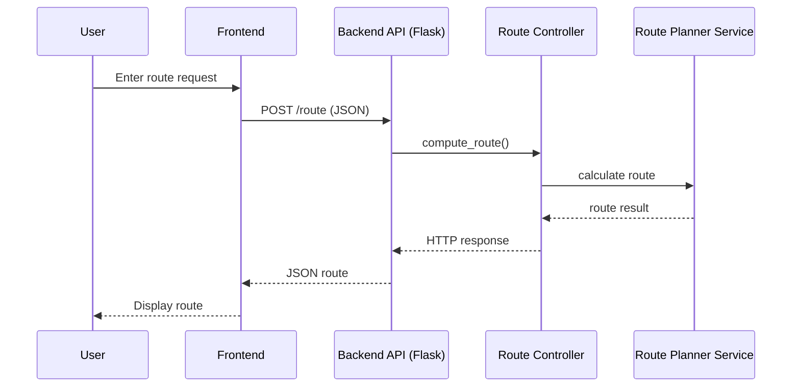
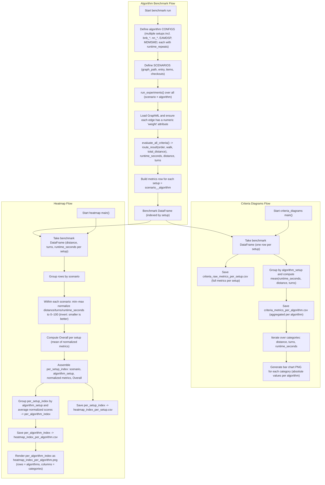

# Indoor Shopping Navigation

Indoor navigation prototype developed within the **Location Based Services** master course.

Indoor Shopping Navigation is a prototype for routing shoppers through an indoor store layout. The project consists of a **Flask backend** for route calculation and product data, and a **React frontend (Vite + TypeScript)** for visualizing the floor plan, route, and shopping list. A SQLite database was configured as well as a separate, independent algorithm evaluation pipeline to determine the best algorithm for the backend.

---

## Prerequisites

- Python 3.10 or newer  
- Node.js 18 or newer  
- npm (ships with Node.js)

The following commands are for **Windows PowerShell**. Adjust paths as needed.

---

## Contents

- [Project goals](#project-goals)
- [Architecture](#architecture)
- [Repository layout](#repository-layout)
- [Getting started](#getting-started)
  - [Backend (Flask)](#backend-flask)
  - [Frontend (React + Vite)](#frontend-react--vite)
- [Configuration](#configuration)
- [Development workflow (best practices)](#development-workflow-best-practices)
- [Testing](#testing)
- [Troubleshooting](#troubleshooting)
- [Contributing](#contributing)

---

## Project Goals

- Provide an API that returns products and optimized routes through the store graph  
- Render the store layout, shopping list, and computed route in a web UI  
- Keep the system modular and easy to extend with new layouts or routing logic
- Evaluate different algorithms to determine the one most suitable for the project constraint

---

## Architecture

- **Backend**
  - Flask application located in `app/server/`
  - Endpoints:
    - `GET /api/health`
    - `GET /products`
    - `POST /route`

- **Frontend**
  - React application using Vite and TypeScript in `app/frontend/`
  - Uses layout data from `app/frontend/public/layout.json`
  - API base URL defaults to `http://127.0.0.1:8000` (overridable via `VITE_API_BASE_URL`)

- **Database**
  - SQLite database file `indoor_shopping_nav.db` at the repository root

- **Algorithm experiments**
  - Prototypes and benchmarking in `algorithm_testing/`

---

## Repository Layout

```
app/
  frontend/          # React + Vite app
  server/            # Flask backend
  database/          # Database-related resources
resources/           # Supporting assets
algorithm_testing/   # Algorithm experiments + benchmarks
```

---

## Getting Started

### Backend (Flask)

1. Change into the backend folder:

```powershell
cd .\app\server
```

2. Create and activate a virtual environment (recommended):

```powershell
python -m venv .venv
.\.venv\Scripts\Activate.ps1
```

3. Install dependencies (the `requirements.txt` is in the repository root):

```powershell
pip install -r ..\..\requirements.txt
```

4. Start the server:

```powershell
python app.py
```

The API is available at http://127.0.0.1:8000 by default (set `PORT` in a `.env` file to change).

---

### Frontend (React + Vite)

1. Change into the frontend folder:

```powershell
cd .\app\frontend
```

2. Install dependencies:

```powershell
npm install
```

3. Start the development server:

```powershell
npm run dev
```

4. Open the displayed URL in the browser (default):

- http://127.0.0.1:5173

---

## Configuration

Start backend and frontend in separate terminals.

| Setting | Purpose | Default |
|--------|--------|--------|
| `PORT` | API server port | `3001` |
| `DB_PATH` | SQLite file path | `<repo>/indoor_shopping_nav.db` |
| `VITE_API_BASE_URL` | Frontend API base URL | `http://127.0.0.1:8000` |

### Backend Environment File (optional)

The backend reads a `.env` file in `app/server/` via `python-dotenv`.  
Create the file only if you need to override defaults:

```
app/server/.env
```

Example content:

```
PORT=8000
DB_PATH=/absolute/path/to/indoor_shopping_nav.db
```

<!-- > **Note:** The frontend does not require a `.env` file. It falls back to  
> `http://127.0.0.1:8000` when `VITE_API_BASE_URL` is not set. -->

---

## Layout Data

The store layout is defined in:

```
app/frontend/public/layout.json
```

This file contains polygon and node data for the floor plan. Adjust this file if the layout changes.

---

## Usage

- The red marker shows the current position
- The blue marker shows the next target
- When checking off a product, the position jumps to that product
- Completed and upcoming segments are displayed in light red
- The active segment is highlighted in red

---


## UML Sequence Diagram (Mermaid) Web App



---

## Pipeline Workflow for Algorithm Evaluations

